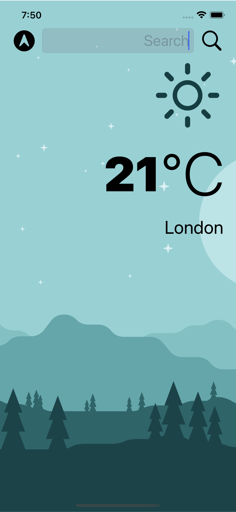

#  Clima
IOS weather app using openweather API. The app can search between cities and also determine the location of the user to automatically provide the correct city. The app can also switch between light and dark themes.

